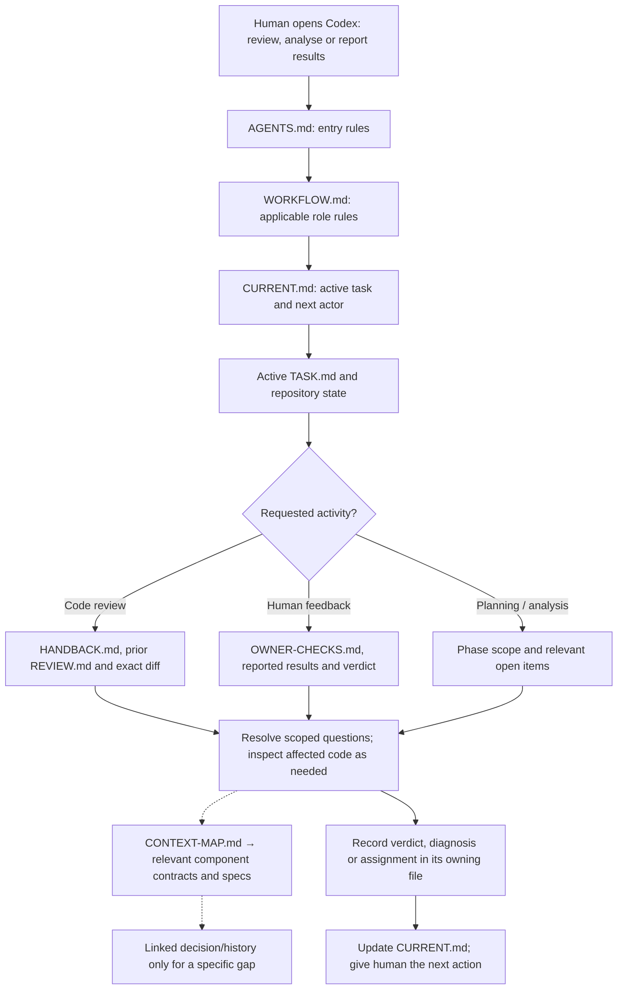
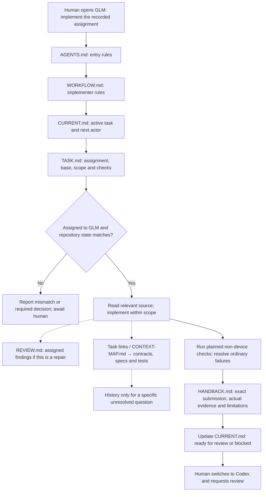

# A portable playbook for human-led AI development

Version: 1.0 — manual workflow reference, 18 September 2026

## Purpose and scope

This playbook describes a human-in-the-loop architect–implementer–reviewer workflow. A capable reasoning model handles architecture, difficult implementation and review; an economical model handles suitable implementation; a human owns product decisions, handoffs and experience acceptance. Model names are project configuration, not part of the method.

The objective is to reduce time and model usage per accepted change while preserving correctness. It does this through bounded tasks, explicit ownership, small current records, selective context loading and evidence-based stopping conditions. Savings are a hypothesis to measure, not a guarantee.

This is a reusable method to adapt deliberately to each repository. It does not authorize work in a project by itself. No automation is required or proposed here.

## 1. Two layers: shared method and local project

A shared GitHub repository can hold this guide, templates, fictional examples and a changelog. Individual projects adopt a chosen version and adapt it locally. Their working instructions must be available inside the project repository.

Suggested shared repository:

```text
README.md                 Overview, quick adoption guide and guide link
PLAYBOOK.md               This detailed explanation
templates/               Small starting templates, not mandatory boilerplate
examples/                Fictional examples showing implementation and repair
CHANGELOG.md              Changes to the shared method
```

Record the adopted upstream version or commit in the local workflow document, along with deliberate project adaptations. A link to the shared guide is useful provenance; it must not require every session to fetch and read the guide. Upstream updates do not silently change project behavior. Adopt them deliberately and reconcile local customizations.

Before public distribution, use generic examples rather than actual project histories. Choose an explicit reuse license when publishing. Keep project histories and private evidence out of the shared guide.

### Adoption procedure

1. Inspect existing instructions, project scope, repository organization and verification capabilities.
2. Preserve current records and uncommitted work before restructuring.
3. Choose role/model assignments, build commands and human-only boundaries for this project.
4. Reuse existing specification and module documentation wherever it already serves the purpose.
5. Create the small entry point, current pointer and one real task. Add only necessary component contracts.
6. Extract still-active constraints and unresolved obligations from old logs; retain historical evidence separately.
7. Replace conflicting startup and ownership instructions. Old entry files may temporarily redirect to the new entry point.
8. Walk through fresh reviewer, implementer and human-feedback sessions. Confirm each agent finds the required records without loading all history.

## 2. Project layout

```text
AGENTS.md
coordination/
  CURRENT.md
  WORKFLOW.md
  tasks/
    TASK-ID/
      TASK.md
      HANDBACK.md          When there is an implementation submission
      REVIEW.md            When there is a review
      OWNER-CHECKS.md      When human acceptance is needed
docs/
  CONTEXT-MAP.md
  components/
    COMPONENT.md
  phases/
    PHASE.md              Optional; use milestones if more appropriate
  decisions/
    ADR-ID.md             Optional; substantial lasting rationale only
  history/
    PHASE-OR-TOPIC.md
PRD.md                    Or the existing product specification location
```

Do not create empty documents for hypothetical future needs. Small projects may combine the context map with the root instructions or keep a task's records in clearly separated sections of one file. The responsibilities below matter more than the exact filenames.

## 3. File responsibilities and ownership

| File | Purpose and minimum contents | Who maintains it | When read |
|---|---|---|---|
| `AGENTS.md` | Entry procedure, project identity, essential restrictions, pointers to workflow and current task | Architect, within owner-approved policy | Every fresh session |
| `coordination/WORKFLOW.md` | Routing policy; implementer/reviewer duties; repair limit; evidence, stopping and documentation rules; adopted playbook version | Architect; owner approves changes to authority or product boundaries | Shared essentials and applicable role section |
| `coordination/CURRENT.md` | Active task path, phase/milestone, workflow state, next actor, blocker/evidence pointers | Agent completing the current step; human orchestrates next actor | Every fresh session |
| `TASK.md` | Task ID, scope, assigned implementer, exact base, relevant contracts/spec sections, invariants, acceptance checks, exclusions and stop condition | Architect before implementation; changed deliberately when scope changes | Every session working on this task |
| `HANDBACK.md` | Latest submission ID and code commit, changes, checks actually run, evidence locations, unresolved limits | Implementer | Submission review and relevant repair sessions |
| `REVIEW.md` | Reviewed submission, comparison base, verdict, finding IDs, consequences, open/resolved status and repair owner | Reviewer | Review/re-review and assigned repairs |
| `OWNER-CHECKS.md` | Numbered setup/actions/expected results; actual human results; tested build; remaining checks | Reviewer prepares; human reports; agent records with attribution | Human acceptance and reported-failure analysis |
| `docs/CONTEXT-MAP.md` | Component/behavior to source paths, specification sections, contracts and tests; explicit read triggers | Agent adding/changing a component boundary | To locate relevant context or investigate unexpected touched areas |
| Component contract | Current responsibility, interfaces, invariants, direct dependencies, code/test pointers and open obligations | Implementer proposes updates; reviewer checks them | When task behavior or touched files involve this component |
| Phase/milestone document | Scope, acceptance criteria, prerequisites, closure evidence and remaining obligations | Architect/reviewer | Planning or validating that phase |
| Decision record (ADR) | Context, chosen decision, reason, consequences, status and supersession link | Agent resolving a substantial decision, with owner input where needed | When its rationale is relevant; normally reached from a component link |
| Historical record | Old submissions, superseded decisions and phase narrative with provenance | Maintained during migration/closure | To answer a specific historical question |
| Product specification | Authoritative intended user-visible behavior | Owner decisions recorded by the responsible agent | Relevant sections, including applicable amendments |

### One fact, one authoritative home

The current-task pointer owns which task is active. The task owns its assignment. The handback owns the builder's submission evidence. The review owns the verdict for that exact submission. Component contracts own current technical constraints. The product specification owns intended behavior.

Other records may link or briefly summarize, but must not maintain competing copies of the same detailed rule. Current-state summaries carry exact references so stale summaries can be detected.

If sources conflict, inspect their authority and explicit supersession. Do not assume the newest timestamp authorizes a product change. Code establishes what exists, not what should exist. Unresolved product contradictions go to the human; missing implementation details can be resolved by scoped code inspection.

## 4. Startup and selective reading

1. Read `AGENTS.md`, then `CURRENT.md` and the relevant workflow rules.
2. Confirm repository identity, Git state, current task and requested activity. Preserve unrelated changes.
3. Read the active `TASK.md`.
4. Load records required for that activity:
   - Implementation: assignment and applicable acceptance criteria.
   - Review: latest handback, submission diff and any unresolved findings.
   - Repair: assigned finding IDs and affected paths.
   - Human feedback: owner checklist, reported results and current review verdict.
   - Planning: phase scope, relevant component map entries and open obligations.
5. Follow task links to applicable component contracts and specification sections.
6. Inspect relevant code and tests. Expand into dependencies when needed for a concrete correctness question.
7. Read historical material only to resolve a named gap in present understanding.

A session opening should briefly state task, activity, boundary and next action. It should not repeat all instructions or print a long reading log.

If the current record says `awaiting_owner`, neither model invents implementation work. If a handback claims a submission that does not match the repository, reconcile the mismatch before editing or approving.

### Context map example

| Trigger | Contract | Relevant dependencies |
|---|---|---|
| Event writes, transaction failure, deletion behavior | Persistence/events | Block repository, event schema |
| Activation, permission return, saved navigation | Navigation/permissions | Persistence/events when transitions write events |
| Target matching or URL normalization | Blocks/targets | Detection and persistence where affected |
| Visual controls and design tokens | Theme/UI | Specific screen specification and design reference |

Each real entry includes actual repository paths. For large maps, group by subsystem and search headings; do not read every entry. Use stable paths/headings and symbol names rather than only fragile line numbers.

This is an explicit routing process, not a promise that models can discover unstated context. Task authors provide starting pointers; implementers and reviewers check changed files for unexpected component involvement.

## 5. Chart: fresh architect/reviewer session

Solid arrows show the normal process. Dotted arrows show selective reading.



Human-result reconciliation does not automatically trigger a new code audit. A reported failure can justify focused inspection. Planning produces an assignment rather than fabricated execution evidence.

## 6. Chart: fresh economical-implementer session



A failed or incomplete implementation is handed back as blocked/incomplete, never as a pass. GLM stops and reports if the required work crosses the agreed critical-logic boundary or needs a product decision. No background dispatch occurs.

## 7. Routing implementation and repairs

- Routine implementation using established patterns: economical model.
- Difficult design or repair involving cancellation, concurrency, durable ordering or nontrivial state machines: capable model by default.
- Routine wiring around an established critical component may still go to the economical model.
- A small localized repair may be implemented directly by the reviewer when local policy authorizes it and a handoff adds unnecessary work.
- If a submitted economical-model repair fails to resolve its assigned defect, reassess ownership before a further repair assignment. Prefer senior implementation for unresolved correctness reasoning.
- Count unsuccessful repair submissions for the same defect, not transient compiler errors. Renaming the task does not reset the defect's repair history.
- Keep one active writer, including coordination-file edits. Model changes and handoffs remain human-controlled.
- The implementer runs proportionate authorized verification. An implementer's own verification is not independent review. High-consequence changes may warrant a separate scoped review.

These are defaults based on task characteristics; they are not universal rankings of model brands. State the recommended owner and reason briefly in the assignment.

### Direct owner-to-implementer corrections

The human may send small, clear testing issues directly to the economical implementer without waiting for the architect or finishing a test pass. Examples include incorrect text, spacing, alignment, icons and straightforward visual mismatches with agreed requirements.

Give the implementer the tested build, starting state, steps, expected result, observed result and checklist ID or screenshot where useful. The implementer records the issue in the active task, makes the scoped correction, runs proportionate checks and updates the handback. Do not create an elaborate new task for every typo.

Escalate before editing if the diagnosis involves data loss, permissions/lifecycle, cancellation, concurrency, event duplication, timing/state correctness, ambiguous behavior or a new product decision. Small-looking symptoms do not establish a simple cause. One unsuccessful submitted repair requires reassessment before another economical-model repair assignment.

The owner can continue testing, recording the installed build and retesting affected checks. The reviewer examines accumulated changes at the next checkpoint. A prior code PASS belongs to its prior submission; new changes remain pending review and final phase clearance must cover the updated submission. Preserve unaffected old results with their original build attribution.

## 8. Review, evidence and stopping rules

Review the exact submitted change and the dependencies needed to judge it. Diff-first does not mean refusing to read unchanged callers or contracts. Consolidate actionable findings; explain the failing scenario, consequence and required correction. Separate blockers from optional improvements.

Re-review starts from the previous reviewed submission and finding IDs. Do not reopen accepted work without a concrete regression, changed dependency or requirement conflict. Once scope and acceptance conditions are met, stop searching for speculative improvements.

Evidence identifies the code revision, command or owner check, result and source. Compilation is not instrumented execution. A builder report is not independent reviewer execution. A screenshot cannot prove a database invariant. Tests passing do not by themselves prove experience acceptance.

Code approval and human acceptance are separate. If a repair affects an already-tested path, identify the specific owner checks that need repeating and preserve unaffected results with their original tested revision. Do not silently relabel old evidence as evidence for new code.

Minimal workflow states are `ready`, `implementing`, `ready_for_review`, `changes_requested`, `awaiting_owner`, `blocked` and `closed`. A state label never substitutes for the corresponding assignment, submission, verdict or evidence.

## 9. Record evolution and preservation

### During a task

Maintain one current task contract, one latest handback and one current review. Before replacing evidence-bearing records, preserve their previous versions in Git or in an explicit small submission snapshot. Do not assume uncommitted edits are recoverable.

Each handback has a submission ID and code commit. Review records tie finding IDs and resolutions to submissions. Documentation may be committed after the code it describes; identify the code commit separately rather than attempting a self-referential commit hash.

### At task closure

Retain the task folder, mark it closed and point `CURRENT.md` to the next task or waiting state. Old task folders are history and are not part of startup reading. Do not maintain a global prose log that repeats every task's complete narrative.

Promote lasting invariants into component contracts, and unresolved obligations into the relevant component/phase record. A task folder should not be the only place a still-active constraint exists.

### At phase closure

Record concise acceptance evidence and remaining explicitly deferred items. Create the next task when authorized. Reuse component contracts and create new ones only as new responsibilities emerge. Phase changes do not require reorganizing the entire repository.

### Document creation rules

Create a file for a coherent independent task, component or substantial decision. Update existing files for ordinary progress. Do not create a file for every session or successful command. Every new record gets an incoming link from its task, phase or context map.

Split a document when it mixes independently useful topics, not merely because it crosses an arbitrary word limit. Keep routine entry material small; roughly 500–1,000 words across essential instructions/current pointers is a starting heuristic, not a hard cap or guaranteed optimum.

Keep full command logs outside routine context and point to them when evidence matters. Do not use output compression that removes the information needed to substantiate a finding.

## 10. Starter content for local records

These are content outlines to adapt, not additional documents that must be read every session.

### Root instruction outline

```text
Project identity and product-specification authority.
Read coordination/CURRENT.md and applicable coordination/WORKFLOW.md rules.
Read the referenced TASK.md and records needed for your requested role.
Load linked component contracts and relevant specification sections on demand.
Verify task ownership, base/submission and repository state before acting.
Preserve unrelated work; one active writer; no speculative scope expansion.
Respect this project's explicit human decision and device-testing boundaries.
Update the owning records at handoff and stop at the recorded boundary.
```

### Current-state outline

```text
Phase/milestone:
Active task: tasks/TASK-ID/TASK.md
State:
Next actor and next action:
Submission/verdict reference, if applicable:
Pending owner input or blocker pointers:
```

### Task outline

```text
Task ID and goal:
Assigned implementer and routing reason:
Base commit and allowed working-tree context:
Scope and exclusions:
Relevant components, specification sections and source paths:
Invariants and acceptance criteria:
Planned checks and required owner validation:
Assigned finding IDs, if a repair:
Stop / escalation condition:
```

### Handback outline

```text
Task/submission ID, base and code commit:
Implemented changes:
Checks actually performed, results and evidence locations:
Unverified behavior and known limitations:
Relevant contract/document updates:
Ready for review or blocked, with reason:
```

### Review outline

```text
Task/submission reviewed and comparison base:
Verdict and scope limitations:
Findings: ID, severity, location, failing scenario, consequence, correction:
Resolution state of earlier findings:
Repair ownership and reason, if needed:
Code acceptance and remaining owner checks:
```

## 11. Minimal human prompts

Reviewer:

> Read AGENTS.md and resume the current task as reviewer. Review the recorded submission and unresolved findings using the repository's context-loading procedure.

Implementer:

> Read AGENTS.md and implement the current task assigned to GLM. Follow its scope, checks and stop condition, then save the handback in the repository.

Human results:

> Read AGENTS.md and resume the current owner-validation task. Here are my results by checklist ID: …

Direct owner correction:

> Read AGENTS.md. Fix this bounded testing issue under the direct owner-to-implementer path: [build, steps, expected, observed, checklist ID]. Escalate if the fix crosses that boundary.

“Read AGENTS.md and resume” is sufficient only when the current record clearly identifies the activity and next actor. Otherwise state the intended role. A waiting state must not be interpreted as permission to invent work.

## 12. Acceptance checks for adopting this playbook

- A fresh reviewer can locate the current submission, prior findings and relevant contracts without the old chat.
- A fresh implementer can locate its exact assignment and required checks without a pasted implementation narrative.
- A fresh human-feedback session can locate stable checklist IDs and the tested build.
- A completed-phase invariant needed later is present in a current contract.
- A superseded decision is clearly historical rather than an active instruction.
- A phase transition only changes current pointers, task records and affected contracts.
- All referenced paths exist; example/template placeholders are absent from live assignments.
- Both harnesses actually discover the local entry instructions; verify this rather than assuming identical behavior.

Track accepted tasks, repair submissions, human coordination time and model usage where available. Adjust the procedure if documentation maintenance costs exceed the rediscovery it prevents.

## Reference

Codex's documented project-instruction mechanism uses `AGENTS.md`: [Custom instructions with AGENTS.md](https://learn.chatgpt.com/docs/agent-configuration/agents-md). The broader file protocol in this guide is a proposed portable convention, not a built-in feature of every coding harness. Explicit startup prompts make its intent clear across tools.
